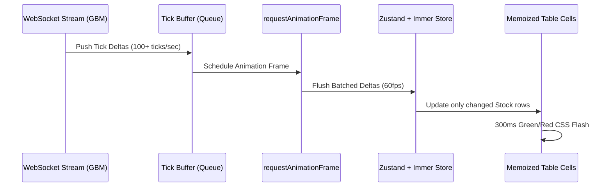

# Real-Time Stock Screener — System Architecture & Design Document

## 1. Executive Summary

This document details the complete architectural foundation for an institutional-grade **Real-Time Stock Screener** built with **Next.js 14**, **TypeScript (Strict Mode)**, **Zustand (with Immer middleware)**, **TanStack React Query v5**, **TanStack React Table v8**, **TanStack React Virtual v3**, **TradingView Lightweight-Charts v5**, and **IndexedDB Persistence**.

The platform is designed to screen, filter, and visualize a universe of **5,000+ equities** in real-time with:
- **High-frequency WebSocket streaming** driven by **Geometric Brownian Motion (GBM)**.
- **requestAnimationFrame (rAF) batching** to eliminate React re-render thrashing.
- **Cell-level `React.memo` memoization** with **300ms green/red price flash animations**.
- **Offline resilience** and **instantaneous hydration with IndexedDB**.
- **30+ criteria complex filter engine (<15ms evaluation)**.
- **Interactive candlestick charts** with pure TypeScript mathematical indicator overlays (SMA, EMA, Bollinger Bands, RSI-14, Volume).

---

## 2. Technology Stack & Decision Matrix

| Layer | Technology | Version | Rationale & Architectural Advantage |
| :--- | :--- | :--- | :--- |
| **Framework** | Next.js (App Router) | `14.2+` | Hybrid SSR/SSG rendering, native API routes, dynamic code splitting with `next/dynamic`. |
| **Language** | TypeScript | `5.6+` | Strict mode enabled (`noImplicitAny`, `strictNullChecks`, `noUncheckedIndexedAccess`). |
| **Streaming & Stochastic Math**| Geometric Brownian Motion | `lib/gbm.ts` | Continuous-time stochastic price evolution ($S_t$) with Box-Muller normal generator. |
| **Render Optimization**| `requestAnimationFrame` Batching | `hooks/useWebSocket.ts` | Flushes high-frequency ticks on display refresh cycles (60Hz), preventing micro-render drops. |
| **Cell Memoization**| `React.memo` + 300ms CSS | `StockTableCells.tsx` | Granular cell isolation; only updated prices re-render with hardware-accelerated flash. |
| **Offline Persistence**| IndexedDB | `lib/indexed-db.ts` | Asynchronous local database for 5,000+ stocks, user watchlists, and instant hydration. |
| **Interactive Charts**| TradingView Lightweight-Charts | `5.0+` | Canvas/WebGL candlestick rendering, lazy-loaded on demand (`next/dynamic`). |
| **Math Engine** | Custom Pure TypeScript | `lib/indicators.ts` | Mathematical algorithms for SMA, EMA, Bollinger Bands, Wilder's RSI, and Volume bars. |
| **Table Engine** | `@tanstack/react-table` | `8.20+` | Headless table logic with column pinning and sorting. |
| **Virtualization** | `@tanstack/react-virtual` | `3.14+` | DOM recycling for 5,000+ rows, 36px fixed row heights, and 15 overscan rows. |
| **Filter Engine** | Custom In-Memory Pipeline | `lib/filter-engine.ts` | Single-pass linear scan with branch pruning & Set lookups (<15ms on 5,200 stocks). |
| **State Management** | Zustand + Immer | `4.5+` / `10.1+` | Decentralized store with mutative proxy updates for fast tick delta processing. |

---

## 3. Directory Structure

```text
├── app/
│   ├── api/
│   │   └── stocks/
│   │       └── route.ts          # API endpoint serving the 5,000+ synthetic equity universe
│   ├── globals.css               # 300ms price flash animations, dark theme tokens, scrollbar
│   ├── layout.tsx                # Root layout with QueryProvider wrapping
│   └── page.tsx                  # Core screener dashboard connecting all layers
├── components/
│   ├── charts/
│   │   ├── LazyTradingViewChart.tsx # Dynamic lazy-loading wrapper (next/dynamic)
│   │   └── TradingViewChart.tsx  # TradingView canvas candlestick chart with indicator overlays & RSI
│   ├── filters/
│   │   ├── DualRangeSlider.tsx   # Dual handle range slider with min/max numeric inputs
│   │   ├── FilterPanel.tsx       # Tabbed modular panel evaluating 30+ criteria
│   │   ├── MultiSelectDropdown.tsx # Searchable multi-select for sectors, exchanges & caps
│   │   └── PresetSelector.tsx    # One-click preset applicator (Value, Growth, Dividend, etc.)
│   └── screener/
│       ├── StockDetailDrawer.tsx # Deep inspection drawer with TradingView chart & valuation ratios
│       ├── StockTable.tsx        # Virtualized table with column pinning, fixed 36px rows & keyboard UX
│       └── StockTableCells.tsx   # React.memo cells with 300ms flash transitions
├── hooks/
│   ├── useStocksQuery.ts         # TanStack React Query hooks with offline client fallback
│   └── useWebSocket.ts           # WebSocket stream hook with GBM & rAF batching
├── lib/
│   ├── chart-data.ts             # OHLCV candlestick historical series generator
│   ├── filter-engine.ts          # High-performance 30+ criteria filtering engine (<15ms)
│   ├── formatters.ts             # Custom financial formatters (Price, %, Cap, P/E, RSI, Vol)
│   ├── gbm.ts                    # Geometric Brownian Motion continuous-time stochastic model
│   ├── indexed-db.ts             # IndexedDB offline storage & hydration layer
│   ├── indicators.ts             # Pure TypeScript mathematical calculations (SMA, EMA, BB, RSI, Vol)
│   └── mock-data.ts              # High-scale synthetic stock universe generator (5,200+ equities)
├── providers/
│   └── QueryProvider.tsx         # React Query Client Context & DevTools provider
├── store/
│   └── useStockStore.ts          # Zustand store with Immer middleware and O(1) ticker lookups
├── types/
│   └── stock.ts                  # Domain definitions: Stock, Sectors, Technicals, Filters, Deltas
├── ARCHITECTURE.md               # System architectural documentation
├── next.config.mjs               # Next.js build and runtime configuration
├── package.json                  # Dependencies and scripts
├── postcss.config.mjs            # PostCSS configuration
├── tailwind.config.ts            # Tailwind CSS configuration with custom financial color palette
└── tsconfig.json                 # TypeScript strict compiler configuration
```

---

## 4. Phase 5: WebSockets, Stochastic Simulation & Render Batching

### 4.1 Geometric Brownian Motion (GBM) Mathematical Model
The market simulation calculates continuous asset pricing paths using the stochastic differential equation:
$$dS_t = \mu S_t dt + \sigma S_t dW_t$$

Integrated via Itô's Lemma:
$$S_{t + \Delta t} = S_t \exp\left(\left(\mu - \frac{1}{2}\sigma^2\right)\Delta t + \sigma \sqrt{\Delta t} Z\right)$$
where:
- $\mu$: Drift rate (annualized expected market return ~7.5%).
- $\sigma$: Volatility parameter scaled by each equity's 30-day volatility and monthly Beta.
- $\Delta t$: Trading time step ($1 / (252 \times 6.5 \times 3600)$).
- $Z \sim \mathcal{N}(0, 1)$: Standard normal random variable computed using the **Box-Muller transform**:
  $$Z = \sqrt{-2 \ln(U_1)} \cos(2\pi U_2)$$

```mermaid
flowchart LR
    A[Box-Muller Transform Z ~ N(0,1)] --> B[GBM Diffusion: sigma * sqrt(dt) * Z]
    B --> C[GBM Drift: (mu - 0.5*sigma^2) * dt]
    C --> D[Next Price Calculation S(t+dt)]
    D --> E[Tick Delta Buffer]
```

### 4.2 `requestAnimationFrame` Batching Pipeline
To eliminate React re-render thrashing from hundreds of ticks per second:
1. Incoming tick deltas from `useWebSocket` push into an in-memory delta queue (`tickBufferRef`).
2. A single `requestAnimationFrame` handle is scheduled.
3. On the next screen repaint cycle, all buffered deltas are flushed as a single batch to `applyTickDeltas()` in Zustand.
4. Immer mutates only target stock records in the $O(1)$ `stockMap`.



### 4.3 `React.memo` Cell Isolation & 300ms Flash
Every cell in `StockTableCells.tsx` (`MemoizedPriceCell`, `MemoizedChangePercentCell`, etc.) is wrapped in `React.memo`. When a price updates:
- Only the specific price cell re-renders.
- A 300ms CSS animation (`.flash-green-300` on uptick, `.flash-red-300` on downtick) triggers hardware-accelerated color fading.

### 4.4 IndexedDB Offline Persistence & Hydration
- **Zero Cold-Start:** On initial launch, `loadUniverseFromIDB()` hydrates the 5,000+ stock universe directly from browser storage before/alongside network requests.
- **Offline Resilience:** The screener remains 100% interactive offline with local search, 30+ criteria filtering, sorting, and persistent watchlists.

---

## 5. Multi-Phase Implementation Roadmap

```mermaid
gantt
    title Stock Screener Implementation Roadmap
    dateFormat  YYYY-MM-DD
    section Phase 1
    Next.js 14 + TS Strict Setup     :done,    p1_1, 2026-09-26, 1d
    Stock Types & Domain Model       :done,    p1_2, 2026-09-26, 1d
    5000+ Synthetic Universe Lib     :done,    p1_3, 2026-09-26, 1d
    Zustand Immer Store + Query      :done,    p1_4, 2026-09-26, 1d
    Architecture Documentation       :done,    p1_5, 2026-09-26, 1d
    section Phase 2
    Virtualized Table (@tanstack/react-virtual) :done,  p2_1, 2026-09-26, 1d
    Column Pinning (Símbolo)         :done,    p2_2, 2026-09-26, 1d
    Keyboard UX (Arrows, Enter, Space):done,    p2_3, 2026-09-26, 1d
    Stock Detail Drawer Inspector    :done,    p2_4, 2026-09-26, 1d
    section Phase 3
    30+ Criteria Filter Engine (<15ms):done,   p3_1, 2026-09-26, 1d
    Modular UI (Sliders, MultiSelect):done,    p3_2, 2026-09-26, 1d
    Presets: Value & Growth Momentum :done,    p3_3, 2026-09-26, 1d
    section Phase 4
    TradingView lightweight-charts   :done,    p4_1, 2026-09-26, 1d
    Pure TypeScript Math Indicators  :done,    p4_2, 2026-09-26, 1d
    Grid Selected Stock Connection   :done,    p4_3, 2026-09-26, 1d
    section Phase 5
    WebSocket Stream Hook (GBM)      :done,    p5_1, 2026-09-26, 1d
    requestAnimationFrame Batching   :done,    p5_2, 2026-09-26, 1d
    300ms Cell Flash & React.memo    :done,    p5_3, 2026-09-26, 1d
    IndexedDB Offline Hydration      :done,    p5_4, 2026-09-26, 1d
```
